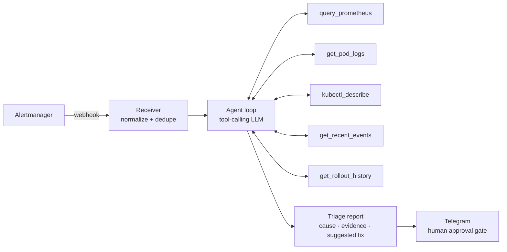

# k8s-incident-triage

> An AI incident-triage agent for Kubernetes. When an alert fires, it
> investigates — querying Prometheus, reading targeted pod logs, checking
> rollout history — and posts a diagnosis with cited evidence to Telegram.
> **Read-only by design. The human stays in command.**

<!-- demo GIF goes here (T5) -->

## The story

I prototyped this  in 2025. It died the classic
death: stuffing raw logs and metrics into the prompt blew the LLM's context
window. This is the rebuild with the architecture that fixes it — **the
model doesn't get dumped context; it gets tools, and pulls only what it
needs.**

## Architecture

### Context discipline (the whole point)

- Every tool returns **bounded** output — log tails are line-capped,
  metric queries are series-capped, oversized results get summarized
  *before* entering the conversation.
- Hard budgets: max 10 tool calls per incident, max total context size.
- Every claim in the report cites the tool call that produced it. Full
  traces logged per incident.

## Security model

- Dedicated ServiceAccount with a **read-only** ClusterRole: `get`/`list`
  on pods, logs, events, deployments. No create, no delete, no exec.
- The agent **never executes remediation** — it suggests commands; a human
  runs them. (Inline approve buttons are on the roadmap; read-only purity
  comes first.)
- **Local-LLM mode (roadmap):** Ollama in-cluster, so logs never leave the
  cluster — built for regulated environments (SAMA-style fintech reality).

## Runs on

Deployed via Helm chart onto
[production-cluster-in-a-box](https://github.com/Mesharimd/production-cluster-in-a-box)
through its GitOps flow — the two repos compose.

## Roadmap

See [Issues](../../issues) — Ollama mode, Slack delivery, approve buttons,
multi-cluster.

## License

MIT
