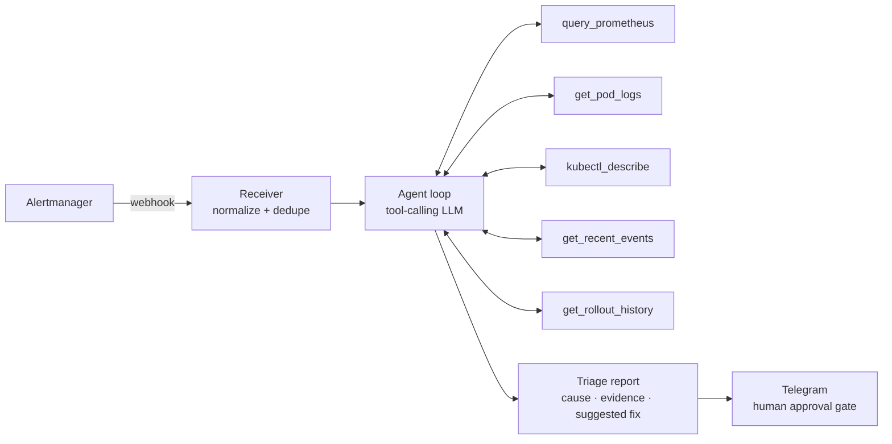

# k8s-incident-triage

[](https://github.com/Mesharimd/k8s-incident-triage/actions/workflows/ci.yml)

> An AI incident-triage agent for Kubernetes. When an alert fires, it
> investigates querying Prometheus, reading targeted pod logs, checking
> rollout history and posts a diagnosis with cited evidence to Telegram.
> **Read-only by design. The human stays in command.**

<!-- demo GIF goes here (T5) -->

## The story

I prototyped this  in 2025. It died the classic
death: stuffing raw logs and metrics into the prompt blew the LLM's context
window. This is the rebuild with the architecture that fixes it  **the
model doesn't get dumped context; it gets tools, and pulls only what it
needs.**

## Architecture



### Context discipline (the whole point)

- Every tool returns **bounded** output — log tails are line-capped,
  metric queries are series-capped, oversized results get summarized
  *before* entering the conversation.
- Hard budgets: max 10 tool calls per incident, max total context size.
- Every claim in the report cites the tool call that produced it. Full
  traces logged per incident; see the [synthetic fixture trace and cost
  method](docs/example-trace.md) for the exact public record shape.

## Model providers

The provider-neutral agent loop is demonstrated with two production adapters:

- **Anthropic** through the Messages API.
- **OpenRouter** through its OpenAI-compatible API. `OPENROUTER_MODEL` can
  select any compatible OpenRouter model; incident triage requires reliable
  tool calling and structured-output support.
- **Ollama** is on the roadmap for fully in-cluster inference.

Set `LLM_PROVIDER` explicitly to `anthropic` or `openrouter`; startup fails
closed for missing or unknown values instead of silently choosing a provider.

## Security model

- Dedicated ServiceAccount with a **read-only** ClusterRole: `get`/`list`
  on pods, logs, events, deployments. No create, no delete, no exec.
- The agent **never executes remediation** — it suggests commands; a human
  runs them. (Inline approve buttons are on the roadmap; read-only purity
  comes first.)
- **Local-LLM mode (roadmap):** Ollama in-cluster, so logs never leave the
  cluster — built for regulated environments (SAMA-style fintech reality).

## Runs on

Deployed via Helm chart onto
[production-cluster-in-a-box](https://github.com/Mesharimd/production-cluster-in-a-box)
through its GitOps flow — the two repos compose.

## Failure demos

The three operator-run demos create one intentionally unhealthy workload and
one matching `PrometheusRule` in the dedicated
`k8s-incident-triage-demo` namespace:

| target | injected failure | resulting alert |
|---|---|---|
| `demo-oom` | memory hog with a 24 MiB limit | `K8sIncidentDemoOOMKilled` |
| `demo-crash` | deliberately missing image tag | `K8sIncidentDemoImagePullBackOff` |
| `demo-latency` | busy loop constrained to 10 millicores | `K8sIncidentDemoCPUStarvation` |

Every target requires an explicit kube context so a demo cannot silently use
whatever cluster happens to be current:

```bash
make demo-oom KUBE_CONTEXT=my-cluster
make demo-clean KUBE_CONTEXT=my-cluster
```

The demo commands mutate only their dedicated namespace; the triage agent and
its Kubernetes credentials remain read-only. Each failing workload continues
until the operator runs `demo-clean`, which removes the three scenario
resources but deliberately leaves the namespace. Live acceptance also verifies
that the target `kube-prometheus-stack` release discovers rules labeled
`release=kube-prometheus-stack` across this namespace.

## Roadmap

See [Issues](../../issues) — Ollama mode, Slack delivery, approve buttons,
multi-cluster.

## License

MIT
